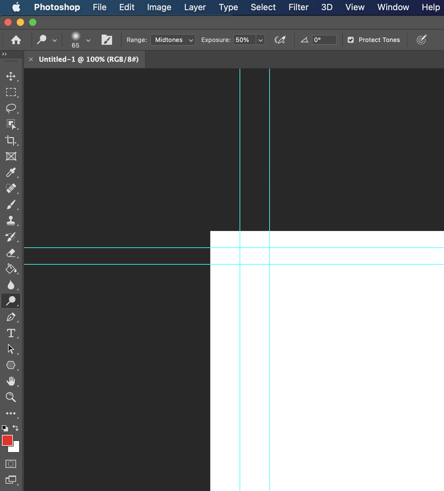

# Adobe Photoshop Tools

Aside from the long list of keybinds for Adobe Photoshop, there also are tools on a banner on the left side of the screen that can be used for a vast number of possibilities in photo editing. This list of buttons is called the "Tools Panel" . I gave the definition and use of some of the buttons on the tools panel that I deem to be essential for beginners. 

	On the left side of the screen, you can see the Tools Panel that contains a basic set of tools ready for use. 
#### Move Tool
This is the first button on the tool panel. It is used to move a selection or layer.
#### Rectangular Marquee Tool
This is the second button down on the tool panel. The Rectangular Marquee tool creates rectangular, including square, selections. Use this tool when you want to zero in on an image, plucking it out of a larger background to provide a better focal point.
#### Magnetic Lasso Tool
This tool is the third tool down on the left tool panel. The handy Magnetic Lasso Tool enables you to make selections that snap onto the object you're trying to select.
#### Crop Tool
This tool is the fifth button down on the tool panel. It can be used on images to crop out certain parts, or people. 
#### EyeDropper Tool 
This tool is the seventh button down on the tool panel.The Eyedropper tool samples color to designate a new foreground or background color. You can sample from the active image or from anywhere else on the screen.
#### Brush Tool 
This tool is the nineth button down on the tool panel. The Brush tool allows you to paint on any layer, much like a real paintbrush. You'll also have different settings to choose from, which can help you customize it for different situations.
#### Clone Stamp Tool 
This tool is the tenth button down on the tool panel. The Clone Stamp tool paints one part of an image over another part of the same image or over another part of any open document that has the same color mode. With this awesome tool you can copy one part of an image and paste it in another area, this is great for photo editing. 
#### Paint Bucket Tool 
This tool is the thirteenth button down on the tool panel. This allows you to select a color, and apply it to an area that is enclosed by lines, the selected color will fill the inside of that line with the color you select. 
#### Blur Tool 
This tool is the fourteenth button down on the tool panel. This is used to blur pixels based on a blur strength slider. This is great for photo editing to remove blemishes or marks on peoples faces. 
#### Hand Tool
This tool is toward the bottome of the tools panel and the button icon is a little hand. This tool is used for grabbing and moving layers or images around on the screen. This is an important tool to remember to use when wanting to manipulate layer position, without this tool selected you can mess up your composition. 

### If you need more help with the tool panel, visit [this site](https://www.photoshop-bootcamp.com/free-printable-photoshop-toolbar-poster/) for a comprehensive cheat sheet. 

 [<--](/Users/alexbohrer/Desktop/Mizzou/Spring2021/IT1600/FinalProject/IT-1600-Final-Project/Page2.md)[Page 4/5][-->](/Users/alexbohrer/Desktop/Mizzou/Spring2021/IT1600/FinalProject/IT-1600-Final-Project/Page4.md)