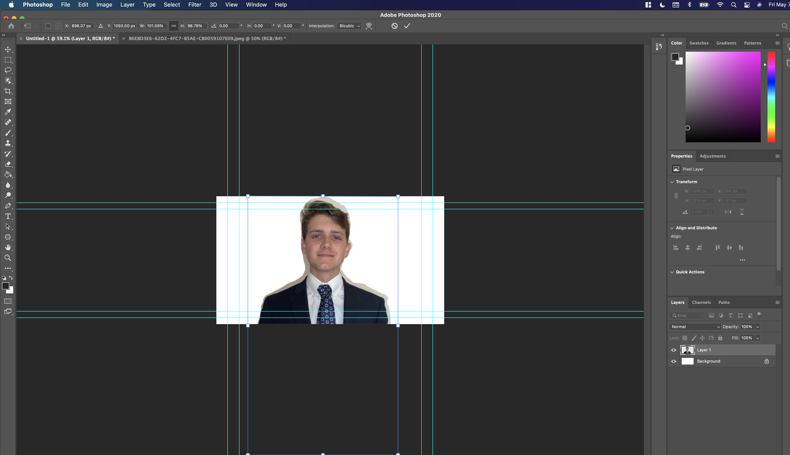
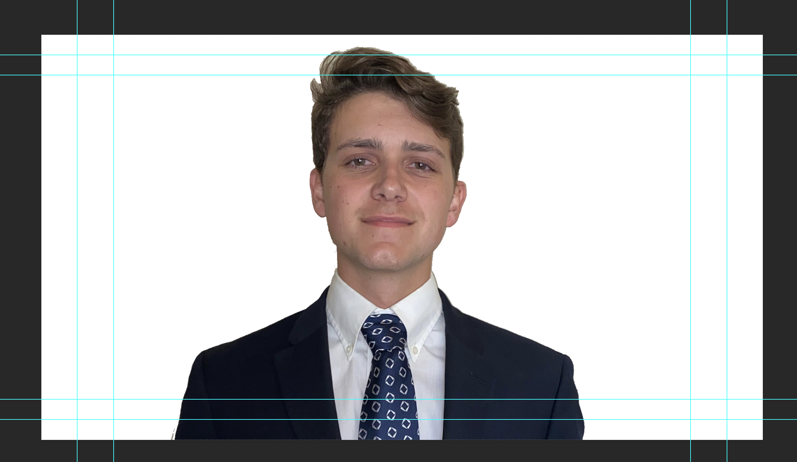

# Application 

##### Editing A Picture For Linkedin Profile Picture
1. Download Adobe Photoshop and install it to your local machine. 
2. Start the application 
3. Select the preset for HDTV 1080p
4. File -> open-> select the image you want to modify.
5. Use Magnetic Lasso to select what you want to cut out of the image. The image should be in its own tab at the top separate from your project. 

6. next you can move the selected part of the pic you want to cut out and move to your new project. 

7. Next you can remove the extra that the magnetic lasso added into your new image.
8. After this you can set a new background to your photo! 

### original photo 

### After Editing

 [<--](/Users/alexbohrer/Desktop/Mizzou/Spring2021/IT1600/FinalProject/IT-1600-Final-Project/Page3.md)[Page 5/5][-->](/Users/alexbohrer/Desktop/Mizzou/Spring2021/IT1600/FinalProject/IT-1600-Final-Project/README.md)